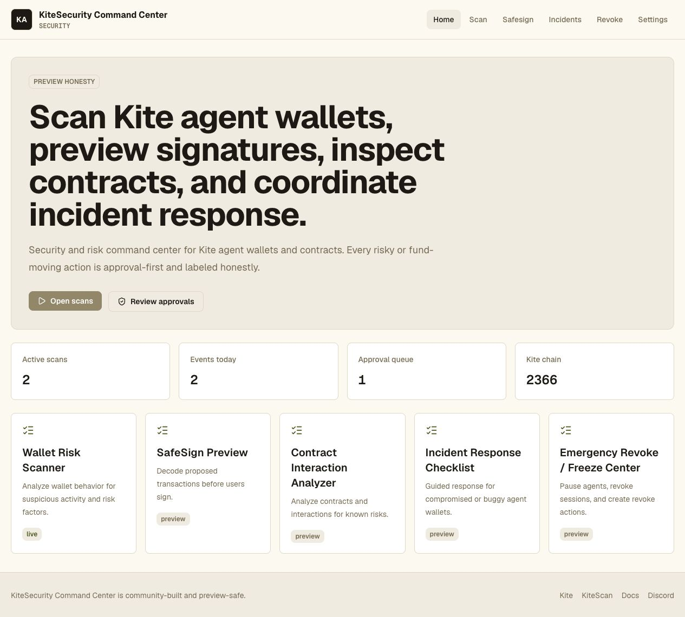

# KiteSecurity Command Center Proof of Work

This repository is a public Kite AI project build with source prompts, runnable code, verification commands, a Vercel deployment, and a rendered screenshot.

## Public Links

- GitHub repo: https://github.com/gnanam1990/kite-security-command-center
- Live Vercel URL: https://kite-security-command-center.vercel.app
- Deployment URL: https://kite-security-command-center-58qtwizrz-gnanam1990s-projects.vercel.app
- Vercel inspect URL: https://vercel.com/gnanam1990s-projects/kite-security-command-center/Dky9GdETLj2SSahqpjqtsUobmcqb
- Vercel deployment ID: `dpl_Dky9GdETLj2SSahqpjqtsUobmcqb`

## Commit Trail

The visible public history is intentionally split into meaningful work units:

1. `feat: build KiteSecurity Command Center MVP`
2. `chore: add Vercel deployment config`
3. `docs: add deployment proof of work`

## Verification Evidence

Local verification completed before deployment:

```bash
pnpm install --frozen-lockfile=false
pnpm -r typecheck
pnpm -r lint
pnpm -r test
pnpm --filter @kite-security-command-center/web build
```

Vercel verification completed during deployment:

- Install command: `pnpm install --frozen-lockfile=false`
- Build command: `pnpm --filter @kite-security-command-center/web build`
- Output directory: `packages/web/dist`
- Ready state: `READY`

## Rendered Screenshot



## Safety Notes

- This is a preview-safe Kite AI application.
- Risky, fund-moving, or wallet actions are clearly approval-first in the product copy and code.
- No official mainnet contract address is invented by this project.
